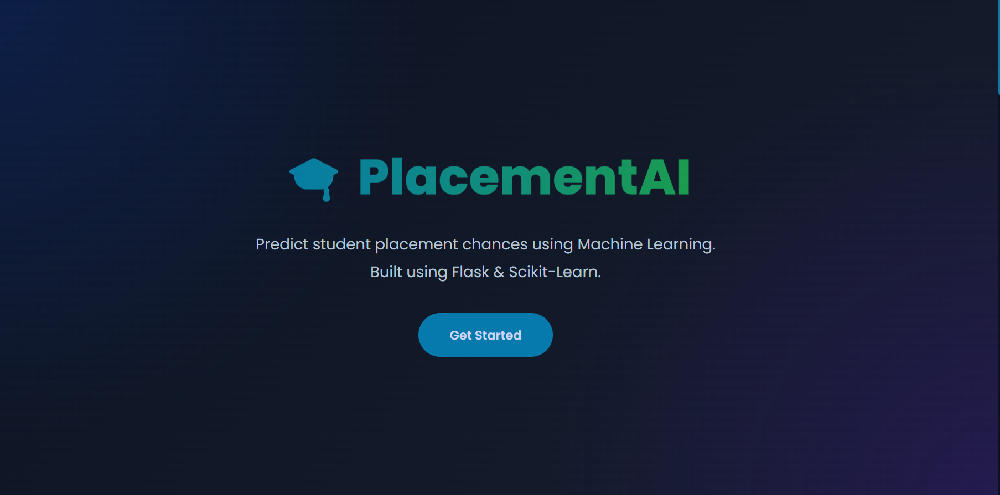
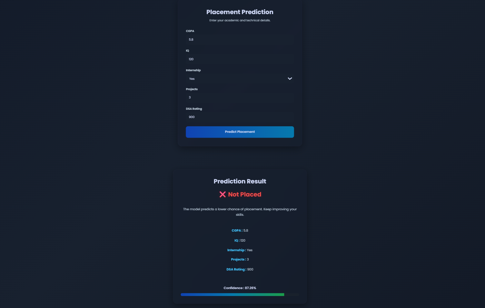

# 🎓 PlacementAI

An end-to-end Machine Learning web application that predicts whether a student is likely to get placed based on academic and technical performance.

🌐 **Live Demo:** https://placementai-rjho.onrender.com/

---

## 🚀 Project Overview

PlacementAI is a Machine Learning web application built using **Flask** and **Scikit-learn**. The model predicts a student's placement status using five important features:

- CGPA
- IQ
- Internship Experience
- Number of Projects
- DSA Rating

The application provides:

- ✅ Placement Prediction
- ✅ Prediction Confidence Score
- ✅ Modern Responsive UI
- ✅ Real-time Prediction using Flask API

---

## 📸 Screenshots

### Landing Page




---

### Prediction Result



---

## 🌍 Live Website

https://placementai-rjho.onrender.com/

---

## 🧠 Machine Learning

### Algorithm

- Logistic Regression

### Input Features

| Feature | Description |
|----------|-------------|
| CGPA | Student's cumulative grade point average |
| IQ | IQ Score |
| Internship | Internship completed (Yes/No) |
| Projects | Number of projects completed |
| DSA Rating | Data Structures & Algorithms Rating |

### Output

- Placed
- Not Placed

Along with the prediction, the model displays a confidence score based on the predicted probability.

---

## 🛠️ Tech Stack

### Frontend

- HTML5
- CSS3
- JavaScript

### Backend

- Flask

### Machine Learning

- Scikit-learn
- NumPy

### Deployment

- Render

---

## 📂 Project Structure

```
PlacementAI
│
├── app.py
├── model.pkl
├── scaler.pkl
├── requirements.txt
├── Procfile
│
├── static
│   ├── style.css
│   └── script.js
│
├── templates
│   └── index.html
│
├── data
│   └── placement.csv
│
└── notebook
    └── placement_prediction.ipynb
```

---

## 📈 Features

- Modern Dark UI
- Responsive Design
- Logistic Regression Model
- Real-time Predictions
- Confidence Score
- Flask REST API
- Deployed on Render

---

## 📊 Dataset

The model was trained on a synthetic campus placement dataset containing academic and technical attributes.

Features used:

- CGPA
- IQ
- Internship
- Projects
- DSA Rating

Target:

- Placement (0 = Not Placed, 1 = Placed)

---

## 👨‍💻 Author

**Kumar Aaditya**

GitHub:
https://github.com/heliosII

---